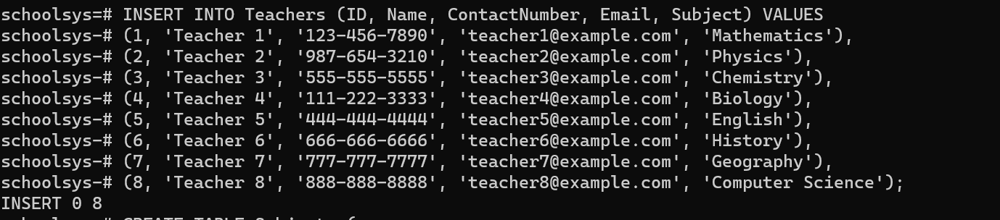
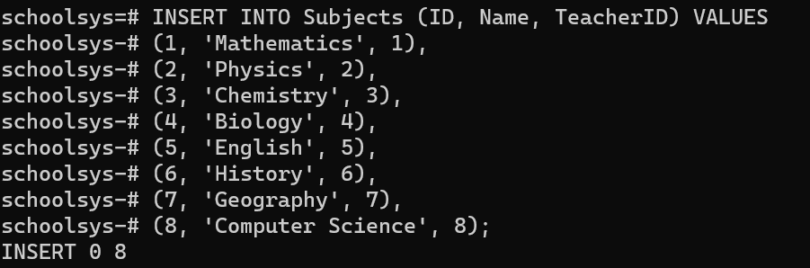
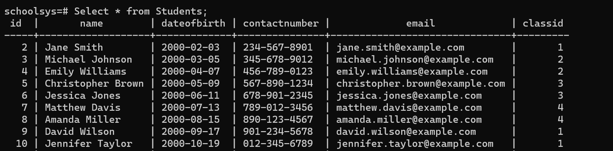
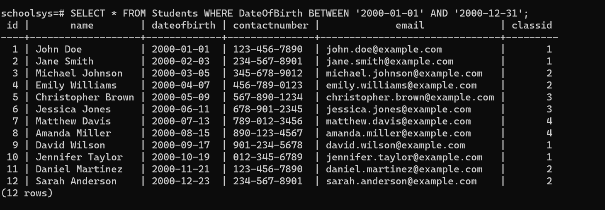
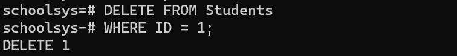
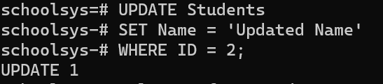
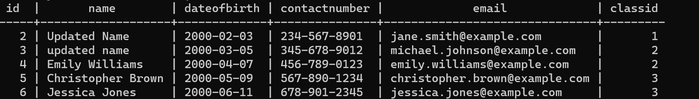

# Postgres Documentation
This is a documentation on using postgresql. Here we have created School Management System Database
Steps are as follow
## ER Diagram

## Creating a Database

## Connecting

## Listing database

## Create Tables

## Inserting data

## Select *

## Select with condition

## Delete 

### result

## Update

### result

